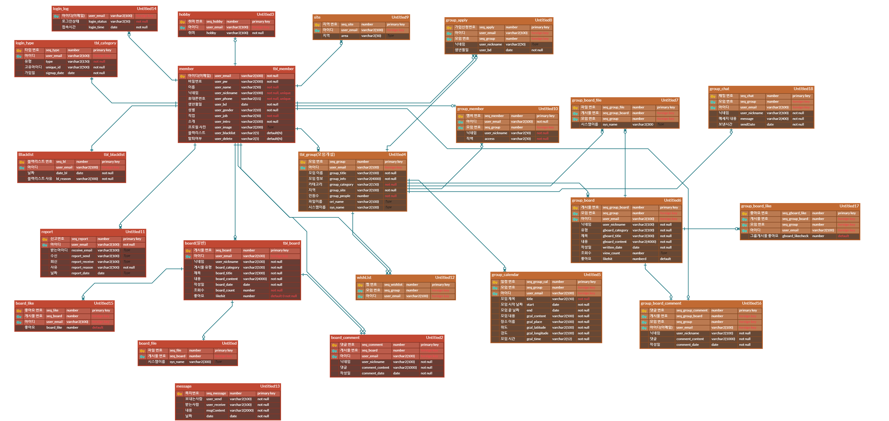
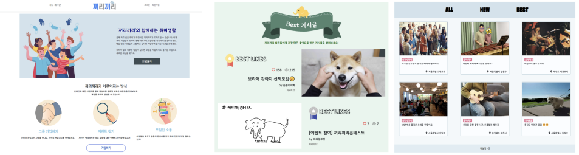
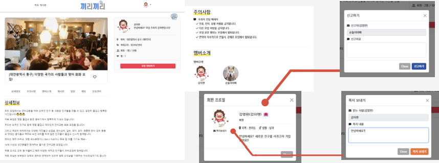
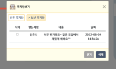
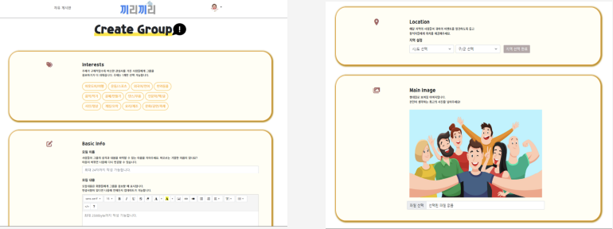

# 파이널 프로젝트

## 📖 프로젝트 개요

- 커뮤니티 기능이 존재하는 취미 활동 및 모임 사이트

---------------------------------------

## 💡 프로젝트 주제 선정 이유

- 모임의 목적이지만, 대다수의 사이트들은 게시글을 등록 할 때, 혹은 모임에 가입할 때 결제를 요구하는 곳이 많았다.
- 타사이트 보다 접근성이 쉬운 페이지를 만들고자 하였다.

위의 내용들을 반영한 사이트인 "끼리끼리" 프로젝트를 기획

---------------------------------------

## 📆 구현 기간

- 프로젝트 기획 기간 : 22.06.28 ~ 22.07.10
- 프로젝트 구현 기간 : 22.07.11 ~ 22.08.05

---------------------------------------

## 🔨 개발 환경 및 사용 도구

| 구분                    | 항목                                                                                            |
|:---------------------:|:---------------------------------------------------------------------------------------------:|
| OS                    | Window10                                                                                      |
| IDE                   | Eclipse, VS Code, SQL Developer                                                               |
| Server / DBMS         | Apache Tomcat 8.5 / Oracle 11g XE                                                             |
| Framework / Platform  | Spring                                                                                        |
| Pattern               | MVC MODEL2 Pattern                                                                            |
| Development Languages | Java, HTML, CSS , Javascript, Jquery, Ajax, MyBatis                                           |
| Front                 | FullCalendar v5.11.2, Chart JS v3.9.1, Sweetalert v11.4.26,  Summernote v0.8.18, Slick Slider |
| Backend               | ojdbc8, cos.jar, gson2.8.9, dbcp2, WebSocket                                                  |
| Open API              | Kakao Login, Kakao Map, Naver Login                                                           |

---------------------------------------

## 🔎 핵심 구현 기술

1️⃣ 사용자 페이지

| 구분    | 내용                                         |
| ----- | ------------------------------------------ |
| 메인    | 현재 진행 중인 모임 노출, 회원가입 유도, 게시판 베스트 글 노출      |
| 모임 목록 | 카테고리 및 지역으로 선정해서 모임 목록 보기                  |
| 로그인   | 로그인(카카오 로그인 API, 네이버 로그인 API), 회원 가입, 로그아웃 |
| 마이페이지 | 개인 정보 수정, 쪽지 및 작성 글 확인                     |
| 게시판   | 게시글 수정 및 삭제, 게시글 댓글 등록 및 수정, 공지사항 확인       |
| 모임    | 모임 생성, 모임 수정, 모임 관리, 모임 게시판, 모임 일정, 모임 채팅  |

2️⃣ 관리자 페이지

| 구분     | 내용                                        |
| ------ | ----------------------------------------- |
| 메인     | 그래프를 통해 당일 로그인 수, 모임 일정 및 회원수(ChartJS) 조회 |
| 회원 관리  | 회원 조회 및 회원 정보 수정                          |
| 게시판 관리 | 게시판 조회 및 삭제, 공지사항 등록                      |
| 모임 관리  | 모임 조회 및 모임 삭제                             |

---------------------------------------

## :memo: ERD Diagram

------------------------

## 😙 나의 역할 및 담당 기능

#### 직책 : 팀원

#### 담당 기능 : 모임 생성 및 수정, 모임 상세페이지, 모임 관리, 모임 목록 보여주기(카테고리, 지역), 회원 쪽지, 회원 신고, 관리자 메인, 관리자 모임

> code

* jsp
  
  * [모임 생성](https://github.com/Hyung-Seok/kirikiri/blob/master/src/main/webapp/WEB-INF/views/group/createGroup.jsp)
  * [모임 수정](https://github.com/Hyung-Seok/kirikiri/blob/master/src/main/webapp/WEB-INF/views/group/modifyGroup.jsp)
  * [모임 상세정보](https://github.com/Hyung-Seok/kirikiri/blob/master/src/main/webapp/WEB-INF/views/group/groupDetail.jsp)
  * [모임 전체 목록](https://github.com/Hyung-Seok/kirikiri/blob/master/src/main/webapp/WEB-INF/views/user/viewAllGroupList.jsp)
  * [모임 카테고리별 목록](https://github.com/kimyeong96/Final_project/blob/main/src/main/webapp/WEB-INF/views/user/categorySelected.jsp)
  * [모임 지역별 목록](https://github.com/Hyung-Seok/kirikiri/blob/master/src/main/webapp/WEB-INF/views/user/siteSelected.jsp)
  * [모임 회원 관리](https://github.com/Hyung-Seok/kirikiri/blob/master/src/main/webapp/WEB-INF/views/group/groupMember.jsp)
  * [모임 가입 승인 및 거절](https://github.com/Hyung-Seok/kirikiri/blob/master/src/main/webapp/WEB-INF/views/group/groupApply.jsp)
  * [모임 해산](https://github.com/Hyung-Seok/kirikiri/blob/master/src/main/webapp/WEB-INF/views/group/groupDelete.jsp)
  * [관리자 메인](https://github.com/Hyung-Seok/kirikiri/blob/master/src/main/webapp/WEB-INF/views/admin/adminMain.jsp)
  * [관리자 모임 관리](https://github.com/Hyung-Seok/kirikiri/blob/master/src/main/webapp/WEB-INF/views/admin/adminGroup.jsp)

* Controller
  
  * [모임 관련](https://github.com/Hyung-Seok/kirikiri/blob/master/src/main/java/com/kiri/controller/GroupController.java)
  * [모임 목록](https://github.com/kimyeong96/Final_project/blob/main/src/main/java/com/kiri/controller/UserController.java)
  * [회원 신고 및 쪽지](https://github.com/Hyung-Seok/kirikiri/blob/master/src/main/java/com/kiri/controller/UserController.java)
  * [관리자](https://github.com/kimyeong96/Final_project/blob/main/src/main/java/com/kiri/controller/AdminController.java)

* Service
  
  * [모임 관리](https://github.com/Hyung-Seok/kirikiri/blob/master/src/main/java/com/kiri/service/Tbl_GroupService.java)
  * [쪽지](https://github.com/Hyung-Seok/kirikiri/blob/master/src/main/java/com/kiri/service/MessageService.java)
  * [신고](https://github.com/Hyung-Seok/kirikiri/blob/master/src/main/java/com/kiri/service/ReportService.java)
  * [모임 목록](https://github.com/Hyung-Seok/kirikiri/blob/master/src/main/java/com/kiri/service/UserService.java)
  * [관리자](https://github.com/Hyung-Seok/kirikiri/blob/master/src/main/java/com/kiri/service/AdminService.java)

* DAO
  
  * [모임 관련](https://github.com/Hyung-Seok/kirikiri/blob/master/src/main/java/com/kiri/dao/Tbl_GroupDAO.java)
  * [쪽지](https://github.com/Hyung-Seok/kirikiri/blob/master/src/main/java/com/kiri/dao/MessageDAO.java)
  * [신고](https://github.com/Hyung-Seok/kirikiri/blob/master/src/main/java/com/kiri/dao/reportDAO.java)
  * [모임 목록](https://github.com/Hyung-Seok/kirikiri/blob/master/src/main/java/com/kiri/dao/UserDAO.java)
  * [관리자](https://github.com/Hyung-Seok/kirikiri/blob/master/src/main/java/com/kiri/dao/AdminDAO.java)

* Mapper
  
  * [모임 관련](https://github.com/Hyung-Seok/kirikiri/blob/master/src/main/resources/mappers/group-mapper.xml)
  * [쪽지](https://github.com/Hyung-Seok/kirikiri/blob/master/src/main/resources/mappers/message-mapper.xml)
  * [신고](https://github.com/Hyung-Seok/kirikiri/blob/master/src/main/resources/mappers/report-mapper.xml)
  * [모임 목록](https://github.com/Hyung-Seok/kirikiri/blob/master/src/main/resources/mappers/user-mapper.xml)
  * [관리자](https://github.com/Hyung-Seok/kirikiri/blob/master/src/main/resources/mappers/admin-mapper.xml)

---------------------------------------

## 📸 완성 화면 및 기능 보기

## 😥 아쉬운 점

- DB 설계를 충분히 했음에도 불구하고, 수정이 불가피했다. 필요없는 컬럼의 삭제와 필요한 컬럼과 테이블의 생성이 반복되었다. 하지만 세미 프로젝트 보다 DB의 수정 빈도가 훨씬 줄어들어 프로젝트를 수행하는데 있어서, 큰 어려움을 겪지 않았다.
- 쪽지 기능을 실시간으로 기능 구현하지 못한점이 아쉽다.

---------------------------------------

## 😃 만족한 점

- 세미 프로젝트 때 잘 사용하지 못했던 Git을 이번 프로젝트에서는 지속적으로 사용하여 팀원들과 공유하며, 소통했다.
- 다양한 라이브러리를 써봤고 라이브러리들의 사용법을 이해하는 능력을 키웠다.
- 다른 사람의 코드를 읽는 능력이 좋아졌다.
- 사용자가 쉽게 이용할 수 있는 사이트를 구현하기 위해, 사용자의 입장에서 다방면으로 생각해 보며 UI를 개선했다.
